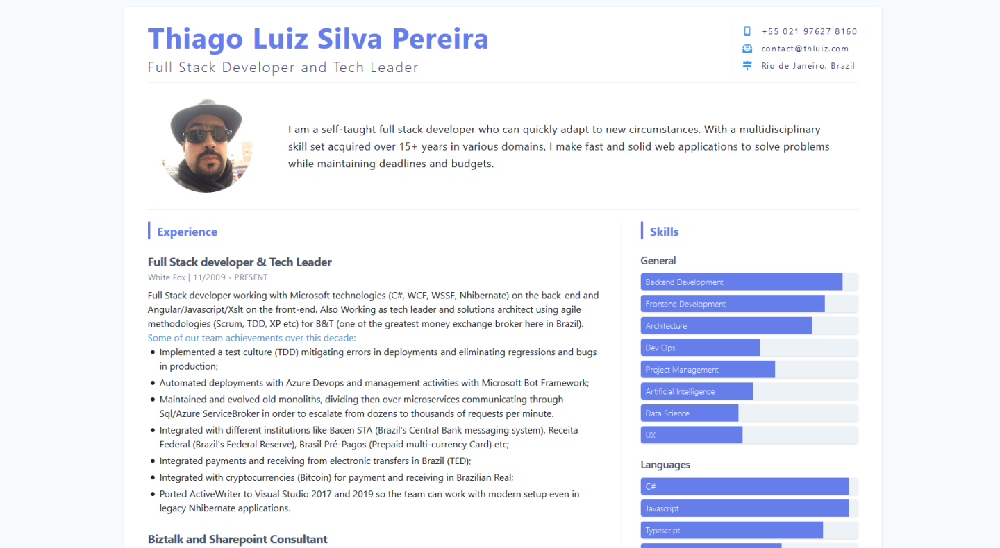

# Welcome to my Resume

This is my resume developed based on the great work of [Baran Cezayirli](https://twitter.com/barancezayirli). Thank you, man! Long live the open source!

Since I have made just a couple of customizations, if you want to build a resume for yourself I think it's more productive to get the original work from him: [Gatsby Starter Resume CMS](https://github.com/barancezayirli/gatsby-starter-resume-cms)

## Customizations upon Cezayirli's work:

- **Summary**
  - Allow html tags in summary;
- **Experience**
  - Allow multi-paragraph descriptions for each experience;
  - Add Key Achievements list to clarify what has been done;
  - Add "Key Achievements" label customization;  
- **Projects**
  - Allow project section title customization;
  - Add project section subtitle;
  - Add technologies field for more details of project
  - Allow multi-paragraph descriptions for projects;
  - Allow multiple-links for each project with link label customization;
- **Education**
  - Add education subtitle;
  - Add education institution link;

